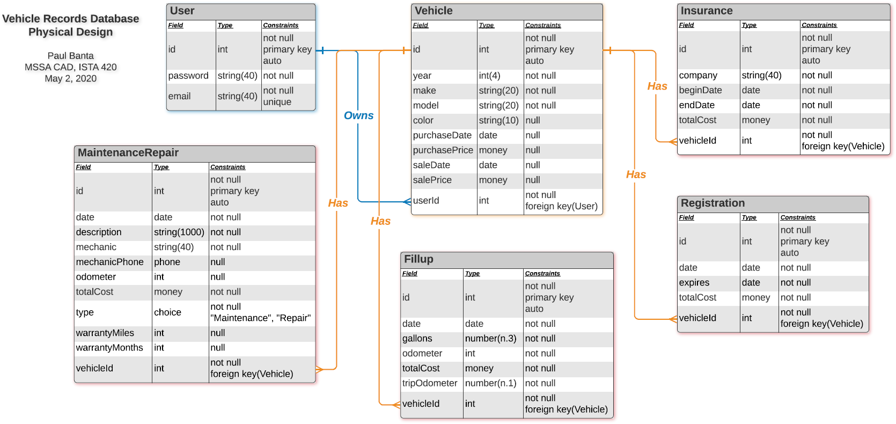

# Vehicle Records Database

## Physical Database Design



## Database Implementation (SQL Script)

### Drop And Create Database
```
USE master;
GO

DROP DATABASE IF EXISTS VehicleRecordsDb;
GO

CREATE DATABASE VehicleRecordsDb;
GO

USE VehicleRecordsDb;
GO

CREATE SCHEMA VehicleRecords AUTHORIZATION dbo;
GO
```

### Users Table
```
CREATE TABLE VehicleRecords.Users
(
   id       INT          IDENTITY(1,1) NOT NULL,
   email    NVARCHAR(40)               NOT NULL,
   password NVARCHAR(40)               NOT NULL,

   CONSTRAINT PK_Users PRIMARY KEY(id),
   CONSTRAINT UC_Email UNIQUE (email)
);
GO

CREATE NONCLUSTERED INDEX idx_nc_users_email ON VehicleRecords.Users(email);
GO

INSERT INTO VehicleRecords.Users(email, password)
   OUTPUT inserted.id
   VALUES (N'PBanta101@GMail.Com', N'PBanta101@GMail.Com'),
          (N'PBanta@Yahoo.Com', N'PBanta@Yahoo.Com'),
		  (N'PBanta@Example.Com', N'PBanta@Example.Com');
GO
```

### Vehicles Table
```
CREATE TABLE VehicleRecords.Vehicles
(
   id     INT          IDENTITY(1,1) NOT NULL,
   year   INT                        NOT NULL,
   make   NVARCHAR(20)               NOT NULL,
   model  NVARCHAR(20)               NOT NULL,
   color  NVARCHAR(10)                   NULL,
   userId INT                        NOT NULL,

   CONSTRAINT PK_Vehicles PRIMARY KEY(id),
   CONSTRAINT FK_Vehicles_Users FOREIGN KEY(userId)
      REFERENCES VehicleRecords.Users(id)
);
GO

INSERT INTO VehicleRecords.Vehicles(year, make, model, color, userId)
   OUTPUT inserted.id
   VALUES (2001, N'Honda', N'CR-V', N'Black', 1),
          (2001, N'Mazda', N'Miata', N'White', 1),
          (2012, N'Mazda', N'3', N'Blue', 2);
GO
```

### Fillups Table
```
CREATE TABLE VehicleRecords.Fillups
(
   id                  INT          IDENTITY(1,1) NOT NULL,
   date                DATE                       NOT NULL DEFAULT CAST(SYSDATETIME() AS DATE),
   gallons             NUMERIC(8, 3)              NOT NULL,
   odometer            INT                        NOT NULL,
   totalCost           MONEY                      NOT NULL,
   tripOdometer        NUMERIC(7, 1)              NOT NULL,
   daysSinceLastFillup INT                            NULL,
   vehicleId           INT                        NOT NULL,

   gallonsPerDay       AS IIF(daysSinceLastfillup > 1, gallons / daysSinceLastFillup, gallons),
   milesPerDay         AS IIF(daysSinceLastFillup > 1, tripOdometer / daysSinceLastFillup, tripOdometer),
   milesPerGallon      AS IIF(gallons > 0, tripOdometer / gallons, 0),
   pricePerDay         AS IIF(daysSinceLastFillup > 1, totalCost / daysSinceLastfillup, totalCost),
   pricePerGallon      AS IIF(gallons > 0, totalCost / gallons, totalCost),
   pricePerMile        AS IIF(tripOdometer > 0, totalCost / tripOdometer, 0),

   CONSTRAINT PK_Fillups PRIMARY KEY(id),
   CONSTRAINT FK_Fillups_Vehicless FOREIGN KEY(vehicleId)
      REFERENCES VehicleRecords.Vehicles(id)
);
GO
```


